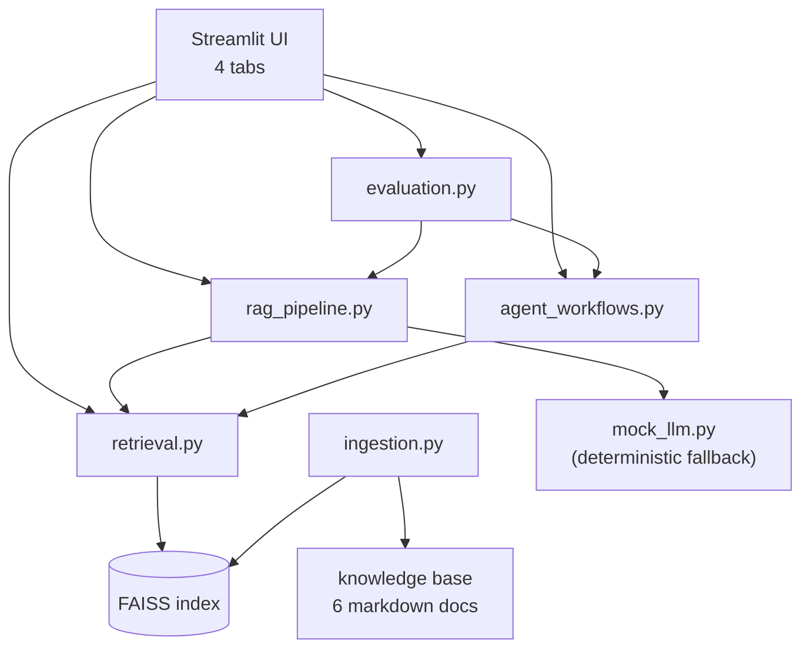

# SOC Engineering Copilot: RAG + Agent Workflow Assistant

An internal AI productivity prototype for SOC / hardware engineering teams. It demonstrates how an AI application engineer would build, evaluate, and ship reliable LLM-backed services for non-AI engineering users — RAG over engineering knowledge, an agentic triage workflow over build/verification logs, and a quantitative evaluation dashboard.

> Built as a portfolio project targeting **NVIDIA JR2017063 — SOC AI Application Engineer (AI Services, Agents and Knowledge Systems), Shanghai**. The knowledge base is synthetic and public-safe; this prototype is not a sign-off authority and does not use proprietary data.

---

## Why this matters

A general-purpose chatbot is the wrong tool for a hardware engineering org: answers must be cited, high-risk topics (CDC, reset, integration, assertion failures) must always defer to a human reviewer, and behavior must be reproducible enough to trust in CI. This project shows the engineering pattern that makes an internal LLM tool actually usable for hardware/SOC teams:

- **Cited answers, not bare LLM output.**
- **Transparent retrieval** so engineers can audit which chunks fed an answer.
- **Deterministic agent orchestration** for triage, with explicit owner-team routing.
- **Mandatory human-review gating** on every high-risk hardware topic.
- **Quantitative evaluation** including a custom Grounded Answer Rate / Citation Faithfulness metric.

## NVIDIA JR2017063 alignment (short table)

| JD requirement | Where this project demonstrates it |
|---|---|
| LLM-backed services for engineering teams | RAG answer pipeline with cited responses (`src/rag_pipeline.py`) |
| RAG / knowledge systems (chunking, embeddings, retrieval, citations) | Header-aware chunker + FAISS vector index with source+section citations (`src/ingestion.py`, `src/retrieval.py`) |
| Agent orchestration / agentic workflows | 6-step deterministic triage agent (`src/agent_workflows.py`) |
| Reusable skills / playbooks | Per-category triage playbooks and prompt templates |
| Evaluation of retrieval and answer quality | QA + workflow evaluation runners with hit rate, MRR, grounded-answer rate, classification + escalation accuracy (`src/evaluation.py`) |
| Reliability — confidence, fallback, human review | Confidence from retrieval signals, deterministic mock LLM fallback, mandatory human review on CDC / reset / integration / assertion topics |
| Internal web tools for non-AI engineering users | Streamlit four-tab internal-tool UI (`app.py`) |

The full traceability table lives in [docs/nvidia_jd_alignment.md](docs/nvidia_jd_alignment.md).

## Features

- **Tab 1 — Ask Copilot.** RAG Q&A with cited answers, confidence pill, and human-review callouts on high-risk topics.
- **Tab 2 — Retrieval Inspector.** Top-k chunks with similarity scores, sources, sections, and a "likely relevant" flag — built so reviewers can see exactly how RAG works.
- **Tab 3 — Workflow Triage Agent.** Paste a build/verification/lint log; the agent runs a six-step pipeline (classify → retrieve → hypothesize → next-steps → escalate → ticket) and returns a structured JSON result.
- **Tab 4 — Evaluation Dashboard.** Retrieval hit rate, MRR, citation coverage, **Grounded Answer Rate / Citation Faithfulness**, missing-context rate, and per-question failure analysis. For triage: classification accuracy, owner accuracy, escalation accuracy, calibration, and human-review rate.

## Architecture



Full diagram and component contracts: [docs/architecture.md](docs/architecture.md).

## Tech stack

- **Python 3.10+**
- **Streamlit** for the UI
- **FAISS** for the local vector index
- **sentence-transformers** for embeddings (with a deterministic hash-vector fallback if the model cannot be loaded)
- **OpenAI-compatible Chat Completions** for the live LLM path (works with OpenAI, Together, Groq, vLLM, Ollama via `OPENAI_BASE_URL`)
- **pandas / numpy** for evaluation and dashboard tables
- **pytest** for tests
- **No paid external services required.** The project runs end-to-end offline.

## Run locally

```bash
# 1. clone, then enter the project
cd soc-design-knowledge-copilot

# 2. create a virtual env and install
python -m venv .venv
source .venv/bin/activate
pip install -r requirements.txt

# 3. (optional) configure the live LLM
cp .env.example .env
# edit .env to set OPENAI_API_KEY; otherwise the deterministic mock LLM is used

# 4. run tests
pytest -q

# 5. launch the app
streamlit run app.py
```

The first launch builds the FAISS index in `data/index/`. Subsequent launches reuse the cached index unless the knowledge base changes (signature is content-hashed). A "Rebuild index" button lives in the sidebar.

## Environment variables

| Variable | Purpose | Default |
|---|---|---|
| `OPENAI_API_KEY` | Enables live LLM path. Leave blank for the deterministic mock LLM. | empty |
| `OPENAI_BASE_URL` | Any OpenAI-compatible endpoint. | `https://api.openai.com/v1` |
| `LLM_MODEL` | Chat-completion model name. | `gpt-4o-mini` |
| `EMBEDDING_MODEL` | sentence-transformers model. | `sentence-transformers/all-MiniLM-L6-v2` |
| `FORCE_MOCK_LLM` | Force the deterministic fallback even if a key is set. | `0` |

## Evaluation methodology

Two held-out evaluation sets ship with the project.

**QA set** — 20 questions in [data/eval/qa_eval_set.json](data/eval/qa_eval_set.json). Each item lists expected source files, expected keywords, topic, difficulty, and whether human review should be triggered. Metrics:

- **Retrieval hit rate @ k** — fraction of questions where any expected source appears in top-k.
- **MRR** of the expected source.
- **Citation coverage** — fraction of generated answers that cite ≥1 expected source.
- **Grounded Answer Rate / Citation Faithfulness** — custom rule-based metric: an answer counts as grounded only if (a) at least one expected source appears in retrieval, AND (b) at least one expected keyword appears in the answer text, AND (c) human-review routing matches expectation for high-risk questions.
- **Avg top-1 / top-k similarity, missing-context rate, high-risk routing accuracy.**

**Workflow set** — 8 triage cases in [data/eval/workflow_eval_set.json](data/eval/workflow_eval_set.json). Each item lists expected category, expected owner team, and expected human-review status. Metrics:

- **Classification accuracy** (issue category).
- **Owner-team accuracy** (correct routing).
- **Escalation accuracy** (correct human-review decision).
- **Calibration** — average confidence on correct vs. incorrect predictions.
- **Human-review rate** — sanity signal for over- or under-escalation.

## Sample results

Numbers below are from a fresh end-to-end run on the synthetic knowledge base shipped in this repo, using the **deterministic mock LLM** path and the **hash-vector embedding fallback** (worst-case configuration — sentence-transformers embeddings typically improve retrieval further). Click **Run evaluation** in the dashboard to reproduce locally.

**QA evaluation (20 questions)**

| Metric | Result |
|---|---|
| Retrieval hit rate @ k=5 | **95%** |
| Mean reciprocal rank (MRR) | **0.875** |
| Citation coverage | **95%** |
| Grounded Answer Rate / Citation Faithfulness | **90%** |
| High-risk routing accuracy | **100%** |

**Workflow triage evaluation (8 cases)**

| Metric | Result |
|---|---|
| Issue-category accuracy | **100%** |
| Owner-team accuracy | **100%** |
| Escalation accuracy | **100%** |
| Human-review rate | 37.5% (3/8 — exactly the high-risk cases) |

The dashboard reports the embedder used and saves a timestamped `eval_results.json` so runs are reproducible across machines.

## Screenshots

Placeholders — capture from a local run and place under `docs/screenshots/`:

- `docs/screenshots/01_ask_copilot.png`
- `docs/screenshots/02_retrieval_inspector.png`
- `docs/screenshots/03_triage_agent.png`
- `docs/screenshots/04_evaluation_dashboard.png`

## Limitations

- **Synthetic public-safe knowledge base.** Real internal documents would be denser and more diverse; a real deployment would also need access controls and PII review.
- **Single-language and English-only** in this prototype.
- **No reranker.** A cross-encoder reranker would likely raise hit rate and grounded-answer rate; left out for simplicity.
- **No long-term memory or per-user preferences.**
- **No GPU dependency.** All embedding and inference paths are CPU-friendly, which keeps the demo portable but caps throughput.

## Future improvements

- Add a cross-encoder reranker on top of FAISS.
- Hybrid retrieval (BM25 + dense) for query types where lexical match dominates.
- Per-domain confidence calibration based on historic eval runs.
- Plug in an internal documentation source via a connector pattern.
- Track per-tool latency and per-step token usage in the dashboard.

## Repository layout

```
soc-design-knowledge-copilot/
  app.py
  requirements.txt
  .env.example
  src/
    config.py
    ingestion.py
    retrieval.py
    rag_pipeline.py
    agent_workflows.py
    evaluation.py
    mock_llm.py
    utils.py
  data/
    knowledge_base/   # 6 synthetic engineering markdown docs
    eval/             # QA (20) + workflow (8) eval sets
    sample_logs/      # 4 synthetic build/verify/lint logs
    index/            # FAISS index cache (gitignored except .gitkeep)
  tests/
    test_retrieval.py
    test_workflow_agent.py
    test_utils.py
  docs/
    project_brief.md
    architecture.md
    nvidia_jd_alignment.md
```

## Disclaimer

This project is a portfolio prototype targeting an NVIDIA AI tooling role. The knowledge base is synthetic and general; nothing in this repository represents proprietary NVIDIA content. The system is not a hardware sign-off authority and is not a substitute for review by a qualified hardware engineer. CDC, reset architecture, integration, and assertion-related topics always trigger human-review gating.
