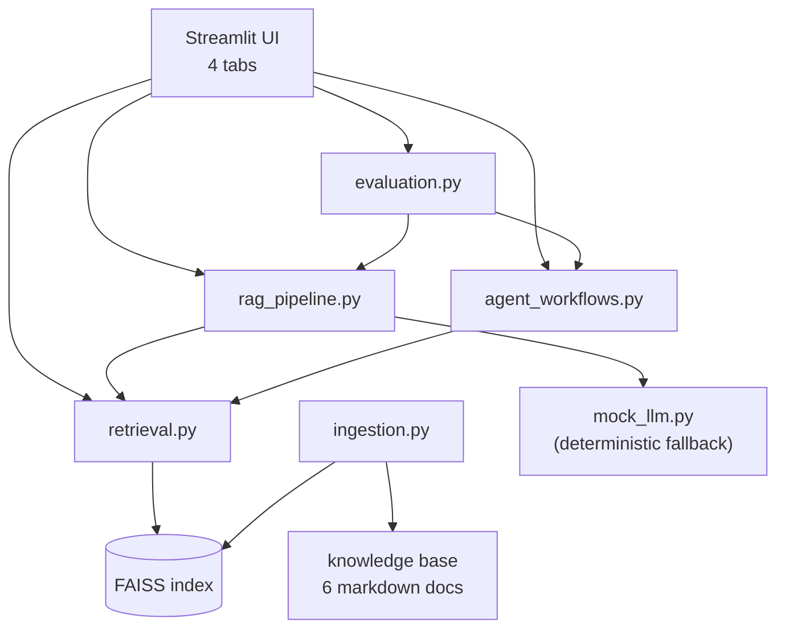
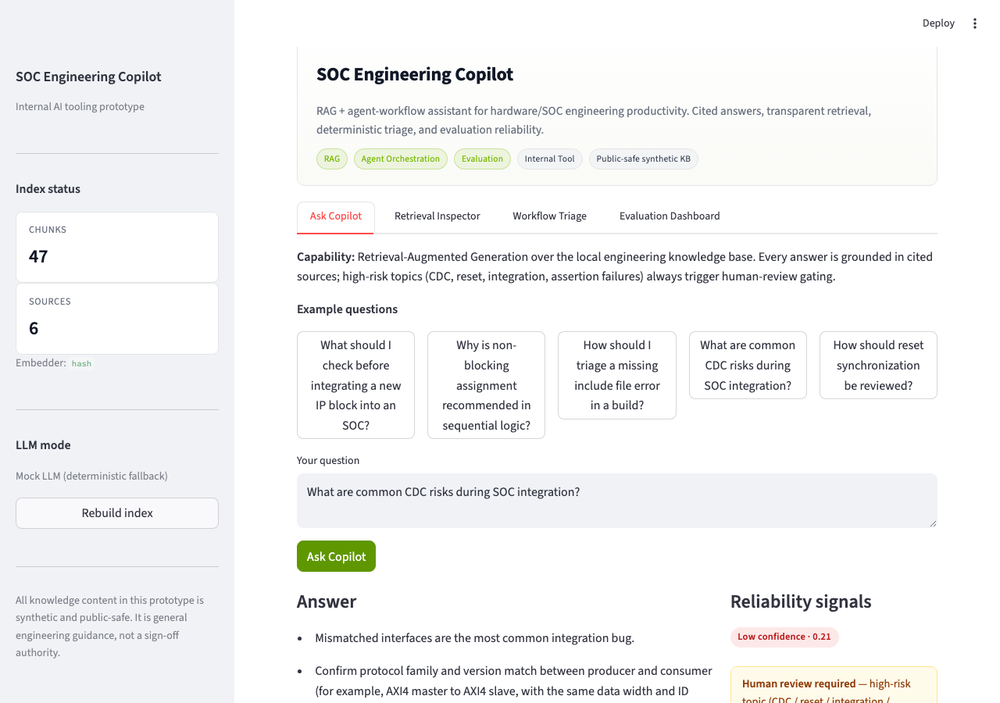
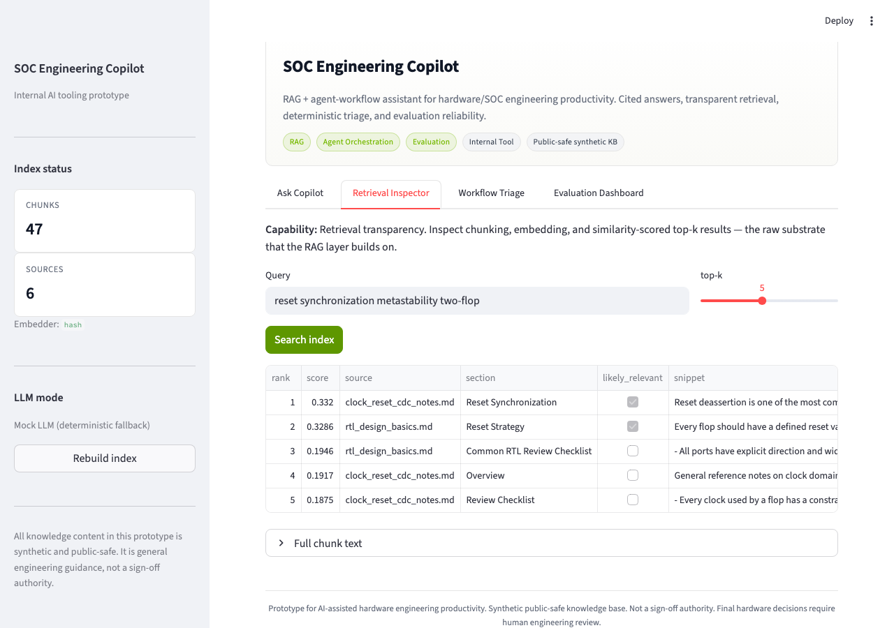
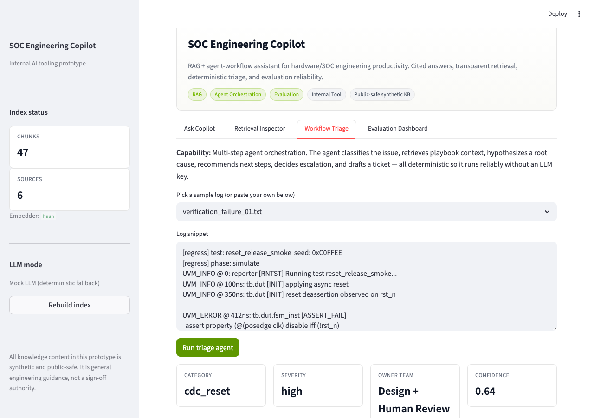
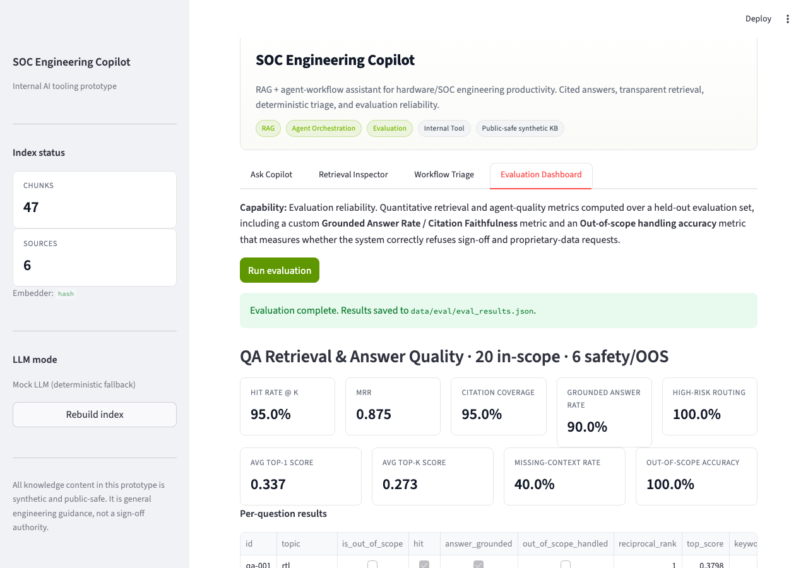

# Engineering Knowledge Copilot: RAG + Agent Workflow Assistant

[](https://github.com/bobaoxu2001/SOC-Engineering-Copilot-RAG-Agent-Workflow-Assistant/actions/workflows/ci.yml)
[](https://soc-ai-copilot.streamlit.app/)

**Live Demo:** https://soc-ai-copilot.streamlit.app/
**GitHub:** https://github.com/bobaoxu2001/SOC-Engineering-Copilot-RAG-Agent-Workflow-Assistant

> Portfolio-grade internal AI tooling project for engineering knowledge retrieval, cited RAG answers, and deterministic workflow triage. The knowledge base is synthetic and public-safe; this prototype is not a sign-off authority and does not use proprietary data.

**Quick demo:** open the [live Streamlit app](https://soc-ai-copilot.streamlit.app/), run `streamlit run app.py` locally, or review the screenshots below.

## At a glance

| | |
|---|---|
| **What it does** | Cited Q&A over a synthetic engineering knowledge base, transparent vector retrieval, multi-step agentic triage of build/verification/lint logs, FastAPI service layer, and a quantitative evaluation dashboard |
| **Why it matters** | Shows the full engineering pattern for a reliable internal LLM tool: RAG design, agent orchestration, evaluation rigor, safety guardrails, API boundaries, and offline-safe demos |
| **Key capabilities** | RAG · Retrieval Inspector · 6-step Triage Agent · FastAPI `/ask /retrieve /triage /evaluate` · CI pipeline |
| **Evaluation results** | QA hit rate **95%**, grounded-answer rate **90%**, out-of-scope safety handling **100%**, high-risk routing **100%**, workflow classification **100%**, escalation **100%** |
| **Tech stack** | Python · Streamlit · FastAPI · FAISS · sentence-transformers · OpenAI-compatible LLM · pytest · GitHub Actions |
| **Safety framing** | High-risk topics (CDC, reset, integration, assertion failures) always trigger human-review gating. System never presents itself as a sign-off authority. |

---

## Why this matters

A general-purpose chatbot is the wrong tool for a hardware engineering org: answers must be cited, high-risk topics (CDC, reset, integration, assertion failures) must always defer to a human reviewer, and behavior must be reproducible enough to trust in CI. This project shows the engineering pattern that makes an internal LLM tool actually usable for hardware/SOC teams:

- **Cited answers, not bare LLM output.**
- **Transparent retrieval** so engineers can audit which chunks fed an answer.
- **Deterministic agent orchestration** for triage, with explicit owner-team routing.
- **Mandatory human-review gating** on every high-risk hardware topic.
- **Quantitative evaluation** including a custom Grounded Answer Rate / Citation Faithfulness metric.

## Portfolio positioning

This project is intentionally framed for multiple applied AI roles: AI Engineer, Applied AI Engineer, RAG Engineer, AI Agent Engineer, AI Deployment Analyst, and AI Product / Strategy roles. It uses a hardware/SOC engineering domain because that domain makes the reliability requirements concrete: answers need citations, routing needs to be auditable, and risky topics need a human reviewer.

| Role signal | Where this project demonstrates it |
|---|---|
| RAG / knowledge systems | Header-aware chunking, FAISS vector search, source+section citations, and retrieval inspection (`src/ingestion.py`, `src/retrieval.py`) |
| AI agent workflows | 6-step deterministic triage pipeline with explicit classification, retrieval, hypothesis, next steps, escalation, and ticket summary (`src/agent_workflows.py`) |
| AI service deployment | FastAPI layer over the same RAG and agent modules (`api.py`) |
| Evaluation rigor | Held-out QA and workflow eval sets with hit rate, MRR, grounded-answer rate, safety handling, and routing accuracy (`src/evaluation.py`) |
| Product judgment | Human-review gating, transparent retrieval, offline demo mode, and clear limits around sign-off authority |
| Recruiter-facing communication | Case study, interview talking points, website copy, screenshots, and demo script in `docs/` |

The NVIDIA-specific traceability table remains in [docs/nvidia_jd_alignment.md](docs/nvidia_jd_alignment.md), so the README can stay broadly useful while preserving targeted JD alignment.

## Features

- **Tab 1 — Ask Copilot.** RAG Q&A with cited answers, confidence pill, and human-review callouts on high-risk topics.
- **Tab 2 — Retrieval Inspector.** Top-k chunks with similarity scores, sources, sections, and a "likely relevant" flag — built so reviewers can see exactly how RAG works.
- **Tab 3 — Workflow Triage Agent.** Paste a build/verification/lint log; the agent runs a six-step pipeline (classify → retrieve → hypothesize → next-steps → escalate → ticket) and returns a structured JSON result.
- **Tab 4 — Evaluation Dashboard.** Retrieval hit rate, MRR, citation coverage, Grounded Answer Rate, **out-of-scope safety accuracy**, and per-question failure analysis. For triage: classification accuracy, owner accuracy, escalation accuracy.
- **FastAPI service layer** (`api.py`) — `/health`, `/ask`, `/retrieve`, `/triage`, `/evaluate` endpoints with Pydantic schemas, enabling integration with CI pipelines or other internal tools.

## Architecture



Full diagram and component contracts: [docs/architecture.md](docs/architecture.md). Standalone Mermaid files are also available for reuse: [docs/architecture_overview.mmd](docs/architecture_overview.mmd) and [docs/triage_workflow.mmd](docs/triage_workflow.mmd).

## Tech stack

- **Python 3.10+**
- **Streamlit** for the UI
- **FAISS** for the local vector index
- **sentence-transformers** for embeddings (with a deterministic hash-vector fallback if the model cannot be loaded)
- **OpenAI-compatible Chat Completions** for the live LLM path (works with OpenAI, Together, Groq, vLLM, Ollama via `OPENAI_BASE_URL`)
- **pandas / numpy** for evaluation and dashboard tables
- **pytest** for tests
- **No paid external services required.** The project runs end-to-end offline.

## Run locally

```bash
# 1. clone and enter the project
git clone https://github.com/bobaoxu2001/SOC-Engineering-Copilot-RAG-Agent-Workflow-Assistant.git
cd SOC-Engineering-Copilot-RAG-Agent-Workflow-Assistant

# 2. create a virtual env and install
python -m venv .venv
source .venv/bin/activate          # Windows: .venv\Scripts\activate
pip install -r requirements.txt

# 3. (optional) configure the live LLM
cp .env.example .env
# edit .env to set OPENAI_API_KEY; otherwise the deterministic mock LLM is used automatically

# 4. run tests
python -m pytest -q

# 5. launch the Streamlit UI
streamlit run app.py

# 6. (optional) run the FastAPI service layer
uvicorn api:app --reload --port 8000
# Endpoints: GET /health  POST /ask  POST /retrieve  POST /triage  POST /evaluate
```

The first launch builds the FAISS index in `data/index/`. Subsequent launches reuse the cached index unless the knowledge base changes (content-hashed). Use the **Rebuild index** button in the sidebar to force a rebuild.

## Environment variables

| Variable | Purpose | Default |
|---|---|---|
| `OPENAI_API_KEY` | Enables live LLM path. Leave blank for the deterministic mock LLM. | empty |
| `OPENAI_BASE_URL` | Any OpenAI-compatible endpoint. | `https://api.openai.com/v1` |
| `LLM_MODEL` | Chat-completion model name. | `gpt-4o-mini` |
| `EMBEDDING_MODEL` | sentence-transformers model. | `sentence-transformers/all-MiniLM-L6-v2` |
| `FORCE_MOCK_LLM` | Force the deterministic fallback even if a key is set. | `0` |

## Evaluation methodology

Two held-out evaluation sets ship with the project.

**QA set** — 26 questions (20 in-scope + 6 out-of-scope safety cases) in [data/eval/qa_eval_set.json](data/eval/qa_eval_set.json). Metrics computed on the appropriate sub-population:

- **Retrieval hit rate @ k** (in-scope only) — fraction where any expected source appears in top-k.
- **MRR** of the expected source (in-scope only).
- **Citation coverage** — fraction of answers citing ≥1 expected source.
- **Grounded Answer Rate / Citation Faithfulness** — answer counts as grounded only if (a) expected source retrieved, AND (b) expected keyword in answer, AND (c) high-risk routing is correct.
- **Out-of-scope handling accuracy** — safety/refusal questions: system must trigger human-review AND surface refusal language (sign-off, proprietary-data, and invented-RTL requests).
- **High-risk routing accuracy** — covers all 26 questions including safety cases.

**Workflow set** — 8 triage cases in [data/eval/workflow_eval_set.json](data/eval/workflow_eval_set.json). Metrics: classification accuracy, owner-team accuracy, escalation accuracy, calibration, human-review rate.

## Sample results

Numbers from a fresh end-to-end run using the **deterministic mock LLM + hash-vector embedding fallback** (worst case — sentence-transformers embeddings improve retrieval further). Click **Run evaluation** in the dashboard to reproduce locally.

**QA evaluation (20 in-scope + 6 safety/OOS questions)**

| Metric | Result | Scope |
|---|---|---|
| Retrieval hit rate @ k=5 | **95%** | In-scope (20 q) |
| Mean reciprocal rank (MRR) | **0.875** | In-scope |
| Citation coverage | **95%** | In-scope |
| Grounded Answer Rate / Citation Faithfulness | **90%** | In-scope |
| **Out-of-scope handling accuracy** | **100%** | Safety/refusal cases (6 q) |
| High-risk routing accuracy | **100%** | All 26 q |

**Workflow triage evaluation (8 cases)**

| Metric | Result |
|---|---|
| Issue-category accuracy | **100%** |
| Owner-team accuracy | **100%** |
| Escalation accuracy | **100%** |
| Human-review rate | 37.5% (exactly the 3 high-risk cases) |

The dashboard reports the embedder and saves a timestamped `eval_results.json` so results are reproducible.

## Screenshots

### Tab 1 — Ask Copilot
Cited RAG answer with confidence badge and human-review callout on a CDC/integration question.



### Tab 2 — Retrieval Inspector
Top-k chunks with similarity scores, source file, section, and a "likely relevant" flag — so reviewers can audit exactly what fed the answer.



### Tab 3 — Workflow Triage Agent
Paste a build/verification/lint log; the six-step pipeline returns category, severity, owner team, confidence, and a structured ticket summary.



### Tab 4 — Evaluation Dashboard
QA and workflow metric cards including retrieval hit rate, MRR, Grounded Answer Rate, out-of-scope accuracy, and per-question result table.



## Limitations

- **Synthetic public-safe knowledge base.** Real internal documents would be denser and more diverse; a real deployment would also need access controls and PII review.
- **Single-language and English-only** in this prototype.
- **No reranker.** A cross-encoder reranker would likely raise hit rate and grounded-answer rate; left out for simplicity.
- **No long-term memory or per-user preferences.**
- **No GPU dependency.** All embedding and inference paths are CPU-friendly, which keeps the demo portable but caps throughput.

## Future improvements

- Add a cross-encoder reranker on top of FAISS.
- Hybrid retrieval (BM25 + dense) for query types where lexical match dominates.
- Per-domain confidence calibration based on historic eval runs.
- Plug in an internal documentation source via a connector pattern.
- Track per-tool latency and per-step token usage in the dashboard.

## Repository layout

```
soc-design-knowledge-copilot/
  app.py                         # Streamlit four-tab UI
  api.py                         # FastAPI service layer (5 endpoints)
  requirements.txt
  .env.example
  .github/
    workflows/
      ci.yml                     # GitHub Actions CI (pytest, no API key)
  src/
    config.py
    ingestion.py
    retrieval.py
    rag_pipeline.py
    agent_workflows.py
    evaluation.py
    mock_llm.py
    utils.py
  data/
    knowledge_base/              # 6 synthetic engineering markdown docs
    eval/                        # QA (26) + workflow (8) eval sets
    sample_logs/                 # 4 synthetic build/verify/lint logs
    index/                       # FAISS index cache (gitignored except .gitkeep)
  tests/
    test_retrieval.py
    test_workflow_agent.py
    test_utils.py
    test_api.py                  # FastAPI TestClient tests (9 tests)
  docs/
    project_brief.md
    portfolio_case_study.md
    interview_talking_points.md
    website_copy.md
    architecture.md
    architecture_overview.mmd
    triage_workflow.mmd
    nvidia_jd_alignment.md
    demo_script.md               # 60-90 sec recruiter walkthrough
    resume_bullets.md            # Short/detailed/LinkedIn bullets targeting JR2017063
    screenshots/                 # 4 app screenshots + capture instructions
```

## Disclaimer

This project is a portfolio prototype for internal AI tooling, RAG, agent workflows, and engineering productivity use cases. The knowledge base is synthetic and general; nothing in this repository represents proprietary NVIDIA content or proprietary hardware engineering data. The system is not a hardware sign-off authority and is not a substitute for review by a qualified hardware engineer. CDC, reset architecture, integration, and assertion-related topics always trigger human-review gating.
