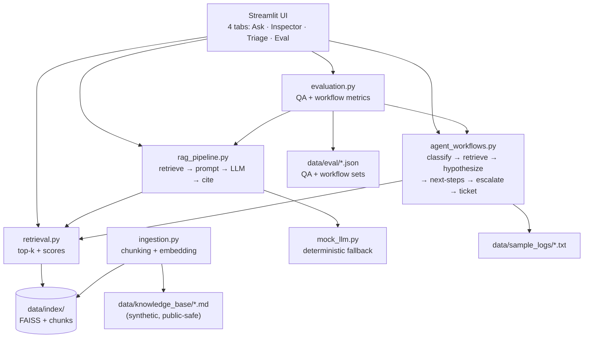

# Architecture

This is a small, deliberately layered codebase. Each module owns one responsibility so a senior reviewer can audit any feature in one or two files.

## Component diagram



## Module responsibilities

- **`src/config.py`** — paths, embedding model, LLM model, thresholds, owner-team mapping. Single source of truth for tuning knobs.
- **`src/utils.py`** — JSON IO, hashing, text cleaning, keyword counts, truncation.
- **`src/mock_llm.py`** — deterministic extractive answer composer and a hashing-based embedder fallback. Used whenever an LLM API key or a downloaded model is unavailable.
- **`src/ingestion.py`** — markdown loader, header-aware chunker, embedder, FAISS index builder. Caches the index keyed on a content signature so repeated runs are cheap.
- **`src/retrieval.py`** — `retrieve(query, top_k)` returns ranked chunks with similarity scores. Cached at the module level for fast repeated queries.
- **`src/rag_pipeline.py`** — assembles the prompt, calls the live LLM if a key is configured, otherwise calls the mock LLM. Computes confidence and high-risk-topic gating.
- **`src/agent_workflows.py`** — six-step triage agent. Each step is a small pure function so the pipeline is auditable end-to-end.
- **`src/evaluation.py`** — runs both eval sets and computes the metrics displayed on the dashboard.
- **`app.py`** — Streamlit UI. Four tabs, each surfacing one capability.

## Key data contracts

```python
# A chunk produced by ingestion.py
Chunk = {
    "chunk_id": str,        # stable, derived from file hash + ordinal
    "source":   str,        # filename, e.g. "rtl_design_basics.md"
    "section":  str,        # nearest H2 header
    "text":     str,
    "n_tokens": int,
}

# A retrieval result
Retrieved = {
    "rank": int,
    "score": float,         # cosine similarity, higher = better
    "likely_relevant": bool,
    "chunk": Chunk,
}

# A RAG answer
RAGResponse = {
    "answer": str,
    "citations": list[str],
    "chunks": list[Retrieved],
    "confidence": float,
    "human_review_required": bool,
    "high_risk_topic": bool,
    "used_mock": bool,
}

# A triage result
TriageResult = {
    "issue_category": "build" | "verification" | "lint" | "cdc_reset" | "unknown",
    "severity": "low" | "medium" | "high",
    "likely_root_cause": str,
    "related_knowledge_sources": list[str],
    "recommended_next_steps": list[str],
    "suggested_owner_team": str,
    "confidence": float,
    "human_review_required": bool,
    "generated_ticket_summary": str,
}
```

## Extending the system

- **Add a new knowledge document** — drop a markdown file into `data/knowledge_base/`. The next run rebuilds the index because the corpus signature changes.
- **Swap the embedding model** — set `EMBEDDING_MODEL` in `.env`. Hash fallback still applies if the model cannot be loaded.
- **Add a new triage category** — extend the pattern lists, `CATEGORY_TO_SOURCES`, `ROOT_CAUSE_TEMPLATES`, `DEFAULT_NEXT_STEPS`, and `OWNER_TEAMS`. Add a workflow eval item to keep regression coverage.
- **Add a new evaluation metric** — extend `evaluation.py` and surface it in the Streamlit dashboard. Existing metric cards are easy to copy.
